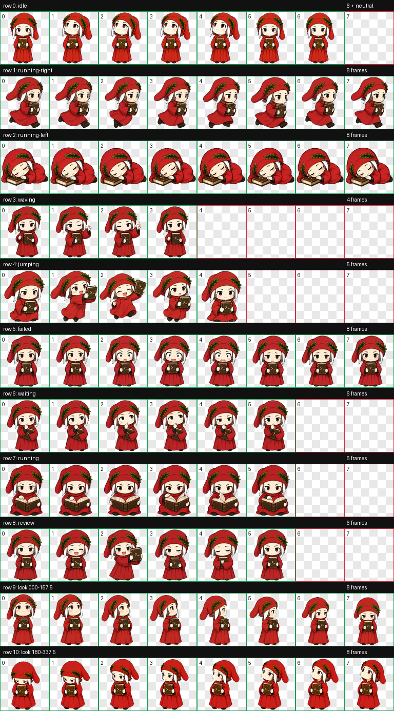

# Dantino Codex Pet · 小但丁桌宠

[English](#english) · [中文](#中文)



<p align="center">
  
</p>

## English

Dantino is an unofficial, two-head-tall chibi Dante companion for Codex. He
wears a crimson robe and laurel-trimmed cap, carries a Codex book marked `>_`,
and reacts to working, waiting, reviewing, running, failure, and look-direction
states.

The idle loop uses a calm open-eyed front pose and a longer upward-looking pose
at one shared full-height scale and foot baseline, with the book mark kept as
`>_`.

The package uses the Codex v2 pet atlas contract:

- RGBA WebP
- 1536 × 2288 pixels
- 8 columns × 11 rows
- 192 × 208 pixels per cell
- 9 activity rows plus 2 look-direction rows

### Install

Clone the repository, then run the installer from its root:

```bash
git clone https://github.com/ruocisong/dantino-codex-pet.git
cd dantino-codex-pet
```

macOS or Linux:

```bash
./scripts/install.sh
```

Windows PowerShell:

```powershell
powershell -ExecutionPolicy Bypass -File .\scripts\install.ps1
```

Manual installation:

```bash
mkdir -p "${CODEX_HOME:-$HOME/.codex}/pets/dantino"
cp package/pet.json package/spritesheet.webp \
  "${CODEX_HOME:-$HOME/.codex}/pets/dantino/"
```

Refresh or restart Codex if Dantino does not appear immediately.

### Uninstall

```bash
./scripts/uninstall.sh
```

or:

```powershell
powershell -ExecutionPolicy Bypass -File .\scripts\uninstall.ps1
```

### Repository contents

- `package/pet.json` — install-ready Codex pet manifest.
- `package/spritesheet.webp` — validated v2 animated atlas.
- `assets/contact-sheet.png` — complete state contact sheet.
- `assets/look-directions.png` — focused look-direction QA sheet.
- `assets/idle.gif` — lightweight idle-loop preview.
- `qa/validation.json` — deterministic atlas validation report.
- `scripts/` — install, uninstall, and local validation helpers.

### Validate

```bash
python3 -m pip install Pillow
python3 scripts/validate.py
```

## 中文

Dantino（小但丁）是一只非官方 Codex 桌宠：二头身、深红长袍、月桂帽，
怀里抱着封面标有 `>_` 的 Codex 古书。他会根据工作、等待、审阅、奔跑、
失败及视线方向切换动作。

### 安装

macOS 或 Linux：

```bash
./scripts/install.sh
```

Windows PowerShell：

```powershell
powershell -ExecutionPolicy Bypass -File .\scripts\install.ps1
```

若安装后没有立即出现在 Codex 宠物列表中，请刷新或重启 Codex。

## Attribution and status

Dantino is an original fan-made interpretation of Dante Alighieri and an
unofficial custom pet for Codex. This project is not affiliated with or endorsed
by OpenAI. “Codex” and related marks belong to their respective owners.

Code and packaged artwork in this repository are released under the MIT License.
